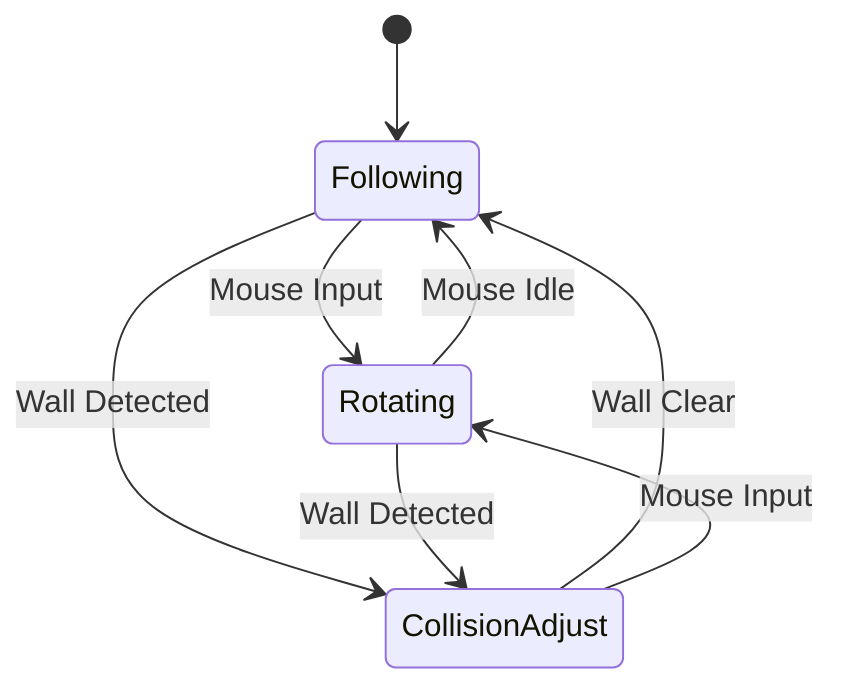

# Camera Controller Design

**Date:** 2025-11-14
**Component:** Camera Systems - Third Person Camera Controller
**Type:** Follow camera with mouse-based rotation

## Design Requirements

### Core Behavior
- ✅ **Third-person perspective** - Camera behind and above player
- ✅ **Mouse rotation** - Camera rotates around player based on mouse movement
- ✅ **Player follows camera forward** - When player moves, they move in camera's looking direction
- ✅ **Dynamic collision handling** - Camera pulls closer when hitting walls (Cinemachine consideration)

### Technical Constraints
- Must work with existing PlayerController
- Smooth camera movement (no jittering)
- Responsive mouse input
- Cursor locked during gameplay

---

## Camera Architecture

### Core Concept: Orbit Camera

The camera orbits around a **CameraTarget** (positioned at player's head level):

```
        Camera (orbit position)
           ↗
          /
    CameraTarget (player's head)
         ↓
    Player Capsule
```

**Key principle:** Camera orbits target, player rotates to match camera forward direction when moving.

---

## Script Architecture

### Class Structure

```
ThirdPersonCamera (MonoBehaviour)
├── Camera component reference
├── Target (CameraTarget transform)
├── Settings (distance, height, sensitivity)
└── Collision detection
```

### Required Scripts

#### 1. **ThirdPersonCamera.cs**
Main camera controller attached to Camera GameObject.

**Responsibilities:**
- Follow CameraTarget smoothly
- Handle mouse input for rotation
- Orbit around target
- Camera collision detection
- Cursor lock/unlock management

**Key Properties:**
```csharp
[Header("Target")]
Transform target // CameraTarget transform

[Header("Camera Settings")]
float distance = 5f // Distance from target
float heightOffset = 0.5f // Additional height above target
float mouseSensitivity = 2f
float smoothTime = 0.1f // Camera follow smoothing

[Header("Rotation Limits")]
float minVerticalAngle = -40f // Look down limit
float maxVerticalAngle = 80f // Look up limit

[Header("Collision")]
float collisionRadius = 0.3f
LayerMask collisionLayers
float minDistance = 1f // Minimum camera distance when colliding
```

**Key Methods:**
```csharp
void LateUpdate() // Update camera after player movement
void HandleMouseInput() // Rotate camera based on mouse
void UpdateCameraPosition() // Calculate orbit position
void HandleCollision() // Check and adjust for wall collision
void LockCursor()
void UnlockCursor()
```

---

#### 2. **PlayerController.cs Modifications**

We need to modify the existing PlayerController to:
- Rotate player to face camera forward direction when moving
- Use camera's forward vector for movement calculation

**Changes needed:**
```csharp
// Add property
public Transform CameraTransform { get; set; }

// Modify movement calculation in states
Vector3 GetCameraRelativeMovement(Vector2 input)
{
    Vector3 forward = CameraTransform.forward;
    Vector3 right = CameraTransform.right;

    forward.y = 0f; // Project to horizontal plane
    right.y = 0f;

    forward.Normalize();
    right.Normalize();

    return forward * input.y + right * input.x;
}
```

---

## Detailed Design

### Camera Rotation System

#### Horizontal Rotation (Yaw)
- Unrestricted 360° rotation
- Mouse X input rotates around Y-axis
- Accumulated rotation angle stored

#### Vertical Rotation (Pitch)
- Restricted to prevent flipping
- Mouse Y input rotates around local X-axis
- Clamped between `minVerticalAngle` and `maxVerticalAngle`

**Implementation:**
```csharp
float yaw = 0f;   // Horizontal rotation
float pitch = 0f; // Vertical rotation

void HandleMouseInput()
{
    float mouseX = Input.GetAxis("Mouse X") * mouseSensitivity;
    float mouseY = Input.GetAxis("Mouse Y") * mouseSensitivity;

    yaw += mouseX;
    pitch -= mouseY; // Inverted for natural feel
    pitch = Mathf.Clamp(pitch, minVerticalAngle, maxVerticalAngle);
}
```

### Camera Position Calculation

**Orbit Position Formula:**
```csharp
Vector3 CalculateCameraPosition()
{
    Quaternion rotation = Quaternion.Euler(pitch, yaw, 0f);
    Vector3 offset = rotation * Vector3.back * distance;
    return target.position + offset;
}
```

**Breakdown:**
1. Create rotation from pitch/yaw angles
2. Apply rotation to "back" vector (0, 0, -1)
3. Multiply by distance
4. Add to target position

### Smooth Follow

Use `Vector3.SmoothDamp` for smooth camera movement:

```csharp
Vector3 currentVelocity = Vector3.zero;

void UpdateCameraPosition()
{
    Vector3 desiredPosition = CalculateCameraPosition();

    Vector3 smoothedPosition = Vector3.SmoothDamp(
        transform.position,
        desiredPosition,
        ref currentVelocity,
        smoothTime
    );

    transform.position = smoothedPosition;
    transform.LookAt(target);
}
```

### Camera Collision Detection

**Problem:** Camera clips through walls when backing into them.

**Solution:** Raycast from target to camera, adjust distance if hit.

```csharp
void HandleCollision()
{
    Vector3 direction = (transform.position - target.position).normalized;
    float desiredDistance = distance;

    RaycastHit hit;
    if (Physics.SphereCast(
        target.position,
        collisionRadius,
        direction,
        out hit,
        desiredDistance,
        collisionLayers))
    {
        // Hit wall, reduce distance
        desiredDistance = Mathf.Max(hit.distance - collisionRadius, minDistance);
    }

    // Apply adjusted distance in CalculateCameraPosition
}
```

**SphereCast vs Raycast:**
- SphereCast prevents camera from getting too close to edges
- `collisionRadius` creates a "safe zone" around camera

---

## Player Movement Integration

### Current Problem
Player movement uses `transform.forward` and `transform.right`:
```csharp
// Current code in WalkState/RunState
Vector3 moveDirection = transform.right * input.x + transform.forward * input.y;
```

This makes player move in their own forward direction, not camera's.

### Solution: Camera-Relative Movement

**Step 1:** Pass camera reference to PlayerController
```csharp
// In PlayerController.cs
public Transform CameraTransform { get; set; }

void Start()
{
    CameraTransform = Camera.main.transform;
}
```

**Step 2:** Add helper method in PlayerController
```csharp
public Vector3 GetCameraRelativeMovement(Vector2 input)
{
    if (CameraTransform == null)
        return transform.right * input.x + transform.forward * input.y;

    Vector3 forward = CameraTransform.forward;
    Vector3 right = CameraTransform.right;

    forward.y = 0f;
    right.y = 0f;

    forward.Normalize();
    right.Normalize();

    return forward * input.y + right * input.x;
}
```

**Step 3:** Modify movement states
```csharp
// In WalkState/RunState Update()
Vector2 input = controller.InputHandler.MovementInput;
Vector3 moveDirection = controller.GetCameraRelativeMovement(input);

if (moveDirection.magnitude > 0.1f)
{
    // Rotate player to face movement direction
    Quaternion targetRotation = Quaternion.LookRotation(moveDirection);
    controller.transform.rotation = Quaternion.Slerp(
        controller.transform.rotation,
        targetRotation,
        Time.deltaTime * 10f // Rotation speed
    );
}

controller.Move(moveDirection.normalized * controller.WalkSpeed);
```

**How it works:**
1. Get camera's forward/right directions (projected to ground plane)
2. Calculate movement direction relative to camera
3. Rotate player to face that direction
4. Move player in that direction

---

## Cursor Management

### Lock Cursor During Gameplay
```csharp
void Start()
{
    LockCursor();
}

void LockCursor()
{
    Cursor.lockState = CursorLockMode.Locked;
    Cursor.visible = false;
}

void UnlockCursor()
{
    Cursor.lockState = CursorLockMode.None;
    Cursor.visible = true;
}

void Update()
{
    // Toggle cursor lock with Escape key
    if (Input.GetKeyDown(KeyCode.Escape))
    {
        if (Cursor.lockState == CursorLockMode.Locked)
            UnlockCursor();
        else
            LockCursor();
    }
}
```

---

## GameObject Setup

### Hierarchy Structure

```
Scene
├── Player
│   ├── (Capsule mesh)
│   ├── PlayerController
│   └── CameraTarget (Empty GameObject)
└── Main Camera
    └── ThirdPersonCamera
```

### CameraTarget Setup
- Position: `(0, 1.5, 0)` relative to Player
- Child of Player GameObject
- This is what camera follows/orbits

### Main Camera Setup
- Position: Initial position doesn't matter (script controls it)
- ThirdPersonCamera script attached
- Target: Assign CameraTarget in Inspector

---

## State Diagram: Camera Behavior



---

## Tunable Parameters

These values will need tweaking during testing:

```csharp
// Distance & Position
float distance = 5f             // How far back camera sits
float heightOffset = 0.5f       // Additional height above target
float minDistance = 1f          // Closest camera can get (collision)

// Sensitivity
float mouseSensitivity = 2f     // Mouse rotation speed
float smoothTime = 0.1f         // Camera follow smoothing

// Rotation Limits
float minVerticalAngle = -40f   // Max look down
float maxVerticalAngle = 80f    // Max look up

// Collision
float collisionRadius = 0.3f    // SphereCast radius
LayerMask collisionLayers       // What blocks camera (Ground, Walls)

// Player Rotation
float playerRotationSpeed = 10f // How fast player turns to face movement
```

---

## Implementation Approach

### Option 1: Custom Script (Planned Above)
**Pros:**
- Full control over behavior
- Lightweight
- Learning opportunity
- Easy to customize for parkour mechanics

**Cons:**
- More code to write
- Need to handle edge cases

### Option 2: Cinemachine (Unity Package)
**Pros:**
- Professional camera system
- Built-in collision handling
- Many presets
- Industry standard

**Cons:**
- Learning curve
- More complex setup
- Potential overkill for prototype

**Recommendation:** Start with **Custom Script** for prototype, consider Cinemachine later if needed.

---

## Files to Create/Modify

### New Files
- `Scripts/Camera/ThirdPersonCamera.cs`

### Modified Files
- `Scripts/Player/PlayerController.cs`
  - Add `CameraTransform` property
  - Add `GetCameraRelativeMovement()` method
- `Scripts/Player/States/WalkState.cs`
  - Use camera-relative movement
  - Add player rotation to face movement
- `Scripts/Player/States/RunState.cs`
  - Same changes as WalkState
- `Scripts/Player/States/SlideState.cs`
  - Keep forward direction (no rotation during slide)

---

## Testing Plan

### Phase 1: Basic Follow
1. Camera follows player smoothly
2. Camera maintains correct distance
3. No jittering

### Phase 2: Mouse Rotation
1. Horizontal rotation (360°) works
2. Vertical rotation works with limits
3. Cursor locks properly
4. Smooth rotation feel

### Phase 3: Player Movement Integration
1. Player moves in camera direction
2. Player rotates to face movement direction
3. Smooth player rotation
4. No conflicts with existing states

### Phase 4: Camera Collision
1. Camera pulls in when hitting walls
2. Camera returns to normal distance when clear
3. No clipping through geometry
4. Smooth distance transitions

---

## Known Challenges

### Challenge 1: Camera Jitter
**Cause:** Player movement and camera movement fighting each other
**Solution:** Use `LateUpdate()` for camera (runs after player Update)

### Challenge 2: Player Rotation During Jump
**Question:** Should player rotate in air or only when grounded?
**Options:**
- A: Allow rotation in air (more responsive)
- B: Lock rotation in air (more realistic)
**Recommendation:** Test both, likely allow rotation in air for parkour feel

### Challenge 3: Slide Direction
**Issue:** When sliding, should player rotate or maintain slide direction?
**Solution:** Maintain original slide direction, ignore camera during slide

---

## Future Enhancements (Post-Prototype)

- [ ] Camera shake on landing
- [ ] Dynamic FOV on sprint
- [ ] Camera offset during wallrun
- [ ] Camera tilt during turns
- [ ] Adjustable camera distance (zoom in/out)
- [ ] Camera presets for different situations
- [ ] Smooth transitions between camera modes

---

## Next Steps

1. ✅ Design complete
2. ⏳ Implement `ThirdPersonCamera.cs`
3. ⏳ Modify `PlayerController.cs` for camera integration
4. ⏳ Update movement states (Walk, Run)
5. ⏳ Set up Camera GameObject in Unity
6. ⏳ Test and tune parameters

---

## Related Documentation

- [Player Controller Design](../player-controller/player-controller-design.md)
- [Component Overview](../component-overview.md)
