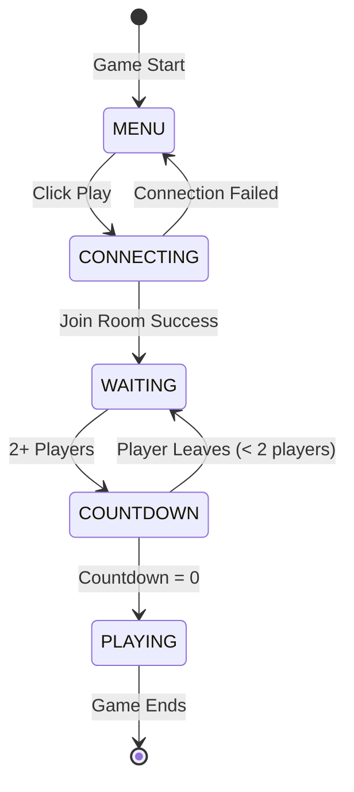

# Lobby UI & Game Start System Design

**Date:** 2025-11-15
**Component:** Game Lobby, Matchmaking UI, Countdown System
**Purpose:** Implement a lobby system where players wait for others, then countdown before game starts

---

## 🎯 **Requirements**

### **User Flow:**
1. **Game Start** → Player sees "PLAY" button in center of screen
2. **Cursor** → Unlocked, visible (no cursor lock initially)
3. **Click Play** → Connect to server, join room
4. **Waiting State** → Player spawned but frozen, UI shows "Waiting for players..."
5. **Player Joins** → When 2+ players in room, countdown starts (e.g., "Game starts in 3...")
6. **Countdown Ends** → UI disappears, players become movable, cursor locks

---

## 📊 **Current System Analysis**

### **Current Flow (BEFORE Changes):**
```
Game Start
    ↓
NetworkManager.Start() → Auto-connect
    ↓
SpawnLocalPlayer() → Player immediately movable
    ↓
Cursor locks in CameraInputProvider.Start()
```

### **Issues with Current System:**
- ❌ Auto-connects on game start (no UI control)
- ❌ Player immediately movable
- ❌ No waiting/lobby state
- ❌ No countdown system
- ❌ Cursor auto-locks

---

## 🏗️ **Proposed Architecture**

### **New Game States:**
```
MENU → CONNECTING → WAITING → COUNTDOWN → PLAYING
```

**State Definitions:**
- **MENU:** Main menu, Play button visible, cursor unlocked
- **CONNECTING:** Joining server/room, loading indicator
- **WAITING:** In lobby, waiting for min players (2), player frozen
- **COUNTDOWN:** Min players met, countdown active, player still frozen
- **PLAYING:** Game active, player movable, cursor locked

---

## 🎨 **UI Components**

### **1. MenuUI (Initial State)**
- **Canvas** (Screen Space - Overlay)
  - **Play Button** (centered)
    - Text: "PLAY"
    - Size: 200x60
    - OnClick → Trigger connection

### **2. LobbyUI (Waiting State)**
- **Canvas** (Screen Space - Overlay)
  - **Status Text** (centered)
    - Text: "Waiting for players..." or "Game starts in {countdown}..."
    - Size: Large, readable
    - Updates dynamically

### **3. Script Organization:**
```
Scripts/
└── UI/
    ├── MenuUI.cs           (Play button, initial screen)
    ├── LobbyUI.cs          (Waiting text, countdown)
    └── GameUIManager.cs    (Manages UI state transitions)
```

---

## 🔧 **Component Design**

### **GameUIManager.cs**
**Responsibility:** Manage UI state, orchestrate transitions

```csharp
namespace ParkourLegion.UI
{
    public enum GameState
    {
        Menu,
        Connecting,
        Waiting,
        Countdown,
        Playing
    }

    public class GameUIManager : MonoBehaviour
    {
        public static GameUIManager Instance { get; private set; }

        [Header("UI References")]
        [SerializeField] private MenuUI menuUI;
        [SerializeField] private LobbyUI lobbyUI;

        private GameState currentState = GameState.Menu;

        public GameState CurrentState => currentState;

        // Methods
        public void SetState(GameState newState);
        public void OnPlayButtonClicked();
        private void ShowMenuUI();
        private void ShowLobbyUI();
        private void HideAllUI();
    }
}
```

---

### **MenuUI.cs**
**Responsibility:** Display and handle Play button

```csharp
namespace ParkourLegion.UI
{
    public class MenuUI : MonoBehaviour
    {
        [Header("References")]
        [SerializeField] private Button playButton;
        [SerializeField] private GameObject menuPanel;

        private void Start()
        {
            playButton.onClick.AddListener(OnPlayClicked);
        }

        private void OnPlayClicked()
        {
            GameUIManager.Instance?.OnPlayButtonClicked();
        }

        public void Show();
        public void Hide();
    }
}
```

---

### **LobbyUI.cs**
**Responsibility:** Display waiting/countdown text

```csharp
namespace ParkourLegion.UI
{
    public class LobbyUI : MonoBehaviour
    {
        [Header("References")]
        [SerializeField] private TextMeshProUGUI statusText;
        [SerializeField] private GameObject lobbyPanel;

        public void ShowWaiting()
        {
            statusText.text = "Waiting for players...";
            lobbyPanel.SetActive(true);
        }

        public void ShowCountdown(int seconds)
        {
            statusText.text = $"Game starts in {seconds}...";
        }

        public void Hide()
        {
            lobbyPanel.SetActive(false);
        }
    }
}
```

---

## 🎮 **Player Control System**

### **PlayerController Modifications**

Add movement enable/disable:

```csharp
public class PlayerController : MonoBehaviour
{
    private bool movementEnabled = false;

    public bool MovementEnabled
    {
        get => movementEnabled;
        set => movementEnabled = value;
    }

    private void Update()
    {
        if (!movementEnabled) return; // Early exit if frozen

        inputHandler.Update();
        isGrounded = physics.CheckGrounded(characterController, transform);
        stateMachine.Update();
    }
}
```

---

## 🌐 **Server-Side Changes**

### **RoomState Schema Updates**

Add game state tracking:

```typescript
// ParkourRoomState.ts
export class ParkourRoomState extends Schema {
    @type({ map: PlayerState })
    players = new MapSchema<PlayerState>();

    @type("string")
    gameState: string = "waiting"; // "waiting" | "countdown" | "playing"

    @type("uint8")
    countdownValue: number = 0;

    @type("uint8")
    playerCount: number = 0;
}
```

### **ParkourRoom.ts Logic**

```typescript
export class ParkourRoom extends Room<ParkourRoomState> {
    private readonly MIN_PLAYERS = 2;
    private readonly COUNTDOWN_SECONDS = 3;
    private countdownInterval?: NodeJS.Timeout;

    onCreate(options: any) {
        this.setState(new ParkourRoomState());
        this.state.gameState = "waiting";
        // ...
    }

    onJoin(client: Client, options: any) {
        // ... existing spawn logic ...

        this.state.playerCount = this.state.players.size;
        this.checkGameStart();
    }

    onLeave(client: Client, consented: boolean) {
        this.state.players.delete(client.sessionId);
        this.state.playerCount = this.state.players.size;

        // If game was counting down and players drop below min, cancel
        if (this.state.gameState === "countdown" && this.state.playerCount < this.MIN_PLAYERS) {
            this.cancelCountdown();
        }
    }

    private checkGameStart() {
        if (this.state.playerCount >= this.MIN_PLAYERS && this.state.gameState === "waiting") {
            this.startCountdown();
        }
    }

    private startCountdown() {
        this.state.gameState = "countdown";
        this.state.countdownValue = this.COUNTDOWN_SECONDS;

        this.countdownInterval = setInterval(() => {
            this.state.countdownValue--;

            if (this.state.countdownValue <= 0) {
                this.startGame();
            }
        }, 1000);
    }

    private cancelCountdown() {
        if (this.countdownInterval) {
            clearInterval(this.countdownInterval);
            this.countdownInterval = undefined;
        }
        this.state.gameState = "waiting";
        this.state.countdownValue = 0;
    }

    private startGame() {
        if (this.countdownInterval) {
            clearInterval(this.countdownInterval);
            this.countdownInterval = undefined;
        }

        this.state.gameState = "playing";
        this.state.countdownValue = 0;

        console.log("Game started!");
    }
}
```

---

## 🔗 **Unity Integration**

### **NetworkManager Modifications**

```csharp
public class NetworkManager : MonoBehaviour
{
    private bool isConnected = false;

    // Remove auto-connect from Start()
    private void Start()
    {
        // DON'T auto-connect anymore
    }

    // New public method for manual connection
    public async void ConnectAndJoin()
    {
        GameUIManager.Instance.SetState(GameState.Connecting);
        await ConnectToServer();
        GameUIManager.Instance.SetState(GameState.Waiting);
    }

    private void SetupRoomHandlers()
    {
        // ... existing handlers ...

        // Listen for game state changes
        room.State.OnChange((changes) => {
            foreach (var change in changes)
            {
                if (change.Field == "gameState")
                {
                    HandleGameStateChange((string)change.Value);
                }
                else if (change.Field == "countdownValue")
                {
                    HandleCountdownUpdate((byte)change.Value);
                }
            }
        });
    }

    private void HandleGameStateChange(string newState)
    {
        switch (newState)
        {
            case "waiting":
                GameUIManager.Instance.SetState(GameState.Waiting);
                break;
            case "countdown":
                GameUIManager.Instance.SetState(GameState.Countdown);
                break;
            case "playing":
                GameUIManager.Instance.SetState(GameState.Playing);
                EnableLocalPlayerMovement();
                break;
        }
    }

    private void HandleCountdownUpdate(byte countdown)
    {
        if (GameUIManager.Instance.CurrentState == GameState.Countdown)
        {
            // Update UI
            FindObjectOfType<LobbyUI>()?.ShowCountdown(countdown);
        }
    }

    private void EnableLocalPlayerMovement()
    {
        if (localPlayer != null)
        {
            var controller = localPlayer.GetComponent<PlayerController>();
            if (controller != null)
            {
                controller.MovementEnabled = true;
            }
        }
    }
}
```

---

## 📋 **Implementation Phases**

### **Phase 1: Unity Schema Update**
- [ ] Add `gameState`, `countdownValue`, `playerCount` to Unity `ParkourRoomState.cs`
- [ ] Regenerate schema if needed
- [ ] Test schema compilation

### **Phase 2: Server-Side Game State**
- [ ] Update `ParkourRoomState.ts` with new fields
- [ ] Implement countdown logic in `ParkourRoom.ts`
- [ ] Add `checkGameStart()`, `startCountdown()`, `cancelCountdown()`, `startGame()`
- [ ] Test server with console logs

### **Phase 3: UI Scripts (Scripted UI Creation)**
- [ ] Create `Scripts/UI/` folder
- [ ] Create `GameUIManager.cs` with state enum and transitions
- [ ] Create `MenuUI.cs` with programmatic Canvas/Button creation
- [ ] Create `LobbyUI.cs` with programmatic Canvas/Text creation
- [ ] Each UI script creates its own Canvas/UI elements in Awake()

### **Phase 4: PlayerController Freeze System**
- [ ] Add `MovementEnabled` property to `PlayerController.cs`
- [ ] Default to `false` (frozen on spawn)
- [ ] Add check in `Update()` to skip input/state machine when frozen
- [ ] Test player freeze

### **Phase 5: NetworkManager Integration**
- [ ] Remove auto-connect from `NetworkManager.Start()`
- [ ] Add `ConnectAndJoin()` public method
- [ ] Add game state change listener
- [ ] Add countdown value listener
- [ ] Implement `EnableLocalPlayerMovement()`
- [ ] Wire up to GameUIManager

### **Phase 6: Cursor Control Integration**
- [ ] Modify `CameraInputProvider.cs` to NOT auto-lock cursor
- [ ] Add public `LockCursor()` and `UnlockCursor()` methods
- [ ] Call from GameUIManager when state changes to PLAYING
- [ ] Ensure cursor unlocked in MENU/WAITING/COUNTDOWN states

### **Phase 7: Full Flow Testing**
- [ ] Test: Game starts → Menu shows → Cursor unlocked
- [ ] Test: Click Play → Connecting → Waiting text shows
- [ ] Test: Second player joins → Countdown starts
- [ ] Test: Countdown reaches 0 → UI hides, movement enabled, cursor locks
- [ ] Test: Player leaves during countdown → Countdown cancels
- [ ] Test: Multiple players join/leave scenarios

---

## 🎨 **UI Layout Specifications**

### **MenuUI:**
```
Screen Space - Overlay
    ↓
Canvas (Centered)
    ↓
Panel (Background: Semi-transparent dark)
    ↓
Play Button
    - Position: Center
    - Size: 200x60
    - Text: "PLAY" (white, bold, size 24)
    - Background: Green (#2ECC71)
    - Hover: Lighter green (#52D988)
```

### **LobbyUI:**
```
Screen Space - Overlay
    ↓
Canvas (Centered)
    ↓
Panel (Background: None)
    ↓
Status Text
    - Position: Center
    - Text: "Waiting for players..." / "Game starts in X..."
    - Font Size: 36
    - Color: White
    - Alignment: Center
```

---

## 🔄 **State Transition Diagram**



---

## 🐛 **Edge Cases to Handle**

1. **Connection Failure:** If join fails, return to Menu with error message
2. **Player Leaves During Countdown:** Cancel countdown, return to Waiting
3. **All Players Leave:** Room disposes (handled by Colyseus)
4. **Late Joiners:** Players join after game starts → Spawn frozen, wait for next round (future)
5. **Reconnection:** Handle reconnect to in-progress game (future)

---

## 💡 **Best Practices**

1. **UI Created Programmatically:** Each UI script creates its own Canvas/elements in `Awake()`
2. **Singleton Pattern:** `GameUIManager` uses singleton for easy access
3. **State-Driven:** All UI changes driven by `GameState` enum
4. **Server Authority:** Game state managed by server, synced to clients
5. **Clean Separation:** UI, Network, Player systems remain decoupled

---

## 🚀 **Future Enhancements** (Not in Initial Scope)

- Player ready system (checkboxes)
- Room browser (list of available rooms)
- Custom player names
- Team selection
- Map voting
- Spectator mode for late joiners

---

## ✅ **Success Criteria**

- ✅ Game starts with Menu UI visible
- ✅ Cursor unlocked in menu
- ✅ Play button triggers connection
- ✅ Player spawns frozen in Waiting state
- ✅ "Waiting for players..." shows when alone
- ✅ Countdown starts when 2+ players
- ✅ Countdown cancels if players leave
- ✅ Game starts when countdown ends
- ✅ UI hides, movement enabled, cursor locks
- ✅ All UI created via code (no manual Canvas setup)

---

**Document Version:** 1.0
**Status:** Ready for implementation
**Estimated Time:** 4-6 hours
