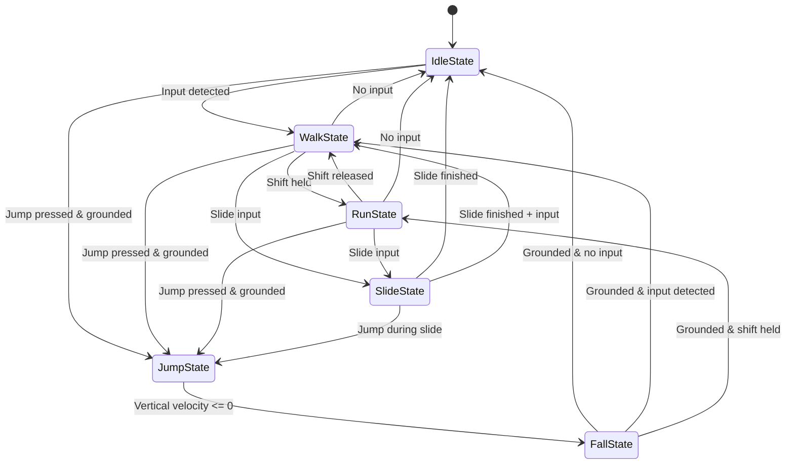

# Player Controller Design

**Date:** 2025-11-14
**Component:** Player Systems - Character Controller
**Type:** State-based controller using CharacterController component

## Design Constraints

### Technical Requirements
- ✅ Use Unity **CharacterController** component (not Rigidbody)
- ✅ Custom physics using **basic motion formulas** (no Rigidbody physics)
- ✅ **State-based system** for clean architecture
- ✅ Support for multiplayer (will be synced via Colyseus)

### Required Actions
1. **Walk** - Base movement
2. **Run** - Activated by holding Shift
3. **Jump** - Triggered by Space key
4. **Slide** - Parkour action

---

## State Machine Architecture

### Core States

```
┌─────────────────────────────────────────────────────┐
│                   GROUNDED STATES                    │
├─────────────────────────────────────────────────────┤
│  • IdleState                                         │
│  • WalkState                                         │
│  • RunState                                          │
│  • SlideState                                        │
└─────────────────────────────────────────────────────┘

┌─────────────────────────────────────────────────────┐
│                    AIRBORNE STATES                   │
├─────────────────────────────────────────────────────┤
│  • JumpState                                         │
│  • FallState                                         │
└─────────────────────────────────────────────────────┘
```

### State Transition Diagram



---

## Script Architecture

### Class Structure

```
PlayerController (MonoBehaviour)
├── PlayerInputHandler (handles input)
├── PlayerPhysics (custom physics calculations)
├── PlayerStateMachine (manages states)
└── States/
    ├── PlayerState (abstract base class)
    ├── IdleState
    ├── WalkState
    ├── RunState
    ├── JumpState
    ├── FallState
    └── SlideState
```

### Core Scripts

#### 1. **PlayerController.cs**
Main controller that orchestrates everything.

**Responsibilities:**
- Initialize components
- Update state machine
- Apply movement via CharacterController
- Provide access to shared data

**Key Properties:**
```csharp
// Components
CharacterController characterController
PlayerInputHandler inputHandler
PlayerPhysics physics
PlayerStateMachine stateMachine

// Movement Settings
float walkSpeed = 5f
float runSpeed = 8f
float jumpHeight = 2f
float slideSpeed = 10f
float slideDuration = 1f

// State
Vector3 velocity
bool isGrounded
```

**Key Methods:**
```csharp
void Awake() // Initialize components
void Update() // Update state machine
void FixedUpdate() // Apply physics
void ApplyMovement() // Move using CharacterController.Move()
```

---

#### 2. **PlayerInputHandler.cs**
Handles all input detection.

**Responsibilities:**
- Detect keyboard/gamepad input
- Provide input state to other components
- No logic, just input detection

**Key Properties:**
```csharp
Vector2 movementInput // WASD / Left stick
bool isRunning // Shift held
bool jumpPressed // Space pressed this frame
bool jumpHeld // Space held
bool slidePressed // Slide key pressed (e.g., C or Ctrl)
```

**Key Methods:**
```csharp
void Update() // Read input every frame
Vector2 GetMovementInput()
bool IsRunning()
bool GetJumpPressed()
bool GetSlidePressed()
```

---

#### 3. **PlayerPhysics.cs**
Custom physics calculations using motion formulas.

**Responsibilities:**
- Apply gravity
- Calculate velocity changes
- Ground detection
- Provide physics utilities

**Key Properties:**
```csharp
float gravity = -9.81f
float groundCheckDistance = 0.2f
LayerMask groundLayer
```

**Key Methods:**
```csharp
void ApplyGravity(ref Vector3 velocity, float deltaTime)
bool CheckGrounded(CharacterController controller)
Vector3 CalculateJumpVelocity(float jumpHeight)
```

**Physics Formulas:**
```csharp
// Gravity application
velocity.y += gravity * deltaTime

// Jump velocity calculation (v² = u² + 2as)
jumpVelocity = Mathf.Sqrt(jumpHeight * 2f * Mathf.Abs(gravity))
```

---

#### 4. **PlayerStateMachine.cs**
Manages state transitions and updates.

**Responsibilities:**
- Hold current state
- Handle state transitions
- Update current state each frame

**Key Properties:**
```csharp
PlayerState currentState
Dictionary<Type, PlayerState> states
```

**Key Methods:**
```csharp
void Initialize(PlayerController controller)
void AddState(PlayerState state)
void ChangeState<T>() where T : PlayerState
void Update()
```

---

#### 5. **PlayerState.cs** (Abstract Base Class)
Base class for all player states.

**Responsibilities:**
- Define state lifecycle (Enter, Update, Exit)
- Provide access to controller
- Abstract methods for state-specific logic

**Key Properties:**
```csharp
protected PlayerController controller
protected string stateName
```

**Key Methods:**
```csharp
abstract void Enter() // Called when entering state
abstract void Update() // Called every frame while in state
abstract void Exit() // Called when exiting state
abstract void CheckTransitions() // Check if should transition to another state
```

---

## Individual State Designs

### **IdleState**

**Purpose:** Player is stationary on the ground.

**Enter:**
- Reset velocity to zero (horizontal)
- Ensure grounded

**Update:**
- Apply gravity
- Check for transitions (input → Walk, jump → Jump)

**Exit:**
- None

**Transitions:**
- **To WalkState:** Movement input detected
- **To JumpState:** Jump pressed && grounded
- **To FallState:** Not grounded (fell off edge)

---

### **WalkState**

**Purpose:** Player is walking (default movement speed).

**Enter:**
- None

**Update:**
- Apply gravity
- Calculate movement direction from input
- Apply walk speed
- Move player via CharacterController

**Exit:**
- None

**Transitions:**
- **To IdleState:** No movement input
- **To RunState:** Shift held
- **To JumpState:** Jump pressed && grounded
- **To SlideState:** Slide input pressed
- **To FallState:** Not grounded

**Movement Calculation:**
```csharp
Vector3 moveDirection = transform.right * input.x + transform.forward * input.y
moveDirection.Normalize()
Vector3 move = moveDirection * walkSpeed * Time.deltaTime
controller.Move(move)
```

---

### **RunState**

**Purpose:** Player is running (faster movement speed).

**Enter:**
- None

**Update:**
- Apply gravity
- Calculate movement direction from input
- Apply run speed (higher than walk)
- Move player via CharacterController

**Exit:**
- None

**Transitions:**
- **To WalkState:** Shift released
- **To IdleState:** No movement input
- **To JumpState:** Jump pressed && grounded
- **To SlideState:** Slide input pressed
- **To FallState:** Not grounded

**Movement Calculation:**
```csharp
// Same as WalkState but with runSpeed
Vector3 move = moveDirection * runSpeed * Time.deltaTime
```

---

### **JumpState**

**Purpose:** Player is ascending after jumping.

**Enter:**
- Calculate and apply jump velocity: `velocity.y = CalculateJumpVelocity(jumpHeight)`
- Play jump animation (future)

**Update:**
- Apply gravity to velocity
- Apply horizontal movement (air control)
- Move player via CharacterController
- Check if vertical velocity <= 0 (peak of jump)

**Exit:**
- None

**Transitions:**
- **To FallState:** When `velocity.y <= 0` (started falling)

**Air Control:**
```csharp
// Allow some horizontal movement in air (reduced control)
float airControlMultiplier = 0.5f
Vector3 airMove = moveDirection * (runSpeed * airControlMultiplier) * Time.deltaTime
```

---

### **FallState**

**Purpose:** Player is falling (gravity pulling down).

**Enter:**
- None

**Update:**
- Apply gravity to velocity
- Apply horizontal movement (air control, similar to jump)
- Move player via CharacterController
- Check if grounded

**Exit:**
- Reset vertical velocity when landing

**Transitions:**
- **To IdleState:** Grounded && no input
- **To WalkState:** Grounded && movement input detected
- **To RunState:** Grounded && shift held

**Landing Logic:**
```csharp
if (isGrounded && velocity.y < 0) {
    velocity.y = -2f // Small downward force to stay grounded
    // Transition to grounded state
}
```

---

### **SlideState**

**Purpose:** Player is sliding (parkour action).

**Enter:**
- Store slide start time
- Set slide velocity (forward direction at slide speed)
- Shrink CharacterController height (crouch)
- Play slide animation (future)

**Update:**
- Apply slide velocity (forward momentum)
- Apply gravity
- Gradually reduce slide speed over duration
- Check if slide duration finished

**Exit:**
- Reset CharacterController height (stand up)

**Transitions:**
- **To IdleState:** Slide finished && no input
- **To WalkState:** Slide finished && input detected
- **To JumpState:** Jump pressed during slide (slide jump)

**Slide Mechanics:**
```csharp
float slideTime = 0f
float slideDuration = 1f
float slideSpeed = 10f

// Enter
slideDirection = transform.forward
slideStartSpeed = slideSpeed

// Update
slideTime += Time.deltaTime
float t = slideTime / slideDuration
float currentSpeed = Mathf.Lerp(slideStartSpeed, walkSpeed, t)

Vector3 slideMove = slideDirection * currentSpeed * Time.deltaTime
controller.Move(slideMove)

// Exit when duration finished
if (slideTime >= slideDuration) {
    TransitionToNextState()
}
```

**Height Adjustment:**
```csharp
// Enter
originalHeight = controller.height
controller.height = originalHeight * 0.5f // Half height for slide
controller.center = new Vector3(0, controller.height / 2, 0)

// Exit
controller.height = originalHeight
controller.center = new Vector3(0, controller.height / 2, 0)
```

---

## Ground Detection

Using CharacterController's built-in collision detection:

```csharp
bool CheckGrounded() {
    // Use CharacterController.isGrounded
    return characterController.isGrounded;
}
```

**Alternative (more reliable):**
```csharp
bool CheckGrounded() {
    // Raycast downward from center
    Vector3 origin = transform.position;
    float checkDistance = (controller.height / 2) + 0.1f;

    return Physics.Raycast(origin, Vector3.down, checkDistance, groundLayer);
}
```

---

## Physics System Details

### Gravity Application

```csharp
void ApplyGravity(ref Vector3 velocity, float deltaTime) {
    if (!isGrounded) {
        velocity.y += gravity * deltaTime;
    } else if (velocity.y < 0) {
        // Small downward force when grounded to stay grounded
        velocity.y = -2f;
    }
}
```

### Jump Velocity Calculation

Using kinematic equation: **v² = u² + 2as**

Where:
- v = final velocity (0 at peak of jump)
- u = initial velocity (what we're solving for)
- a = acceleration (gravity)
- s = displacement (jump height)

Rearranged: **u = √(2 * |gravity| * jumpHeight)**

```csharp
float CalculateJumpVelocity(float jumpHeight) {
    return Mathf.Sqrt(jumpHeight * 2f * Mathf.Abs(gravity));
}
```

### Movement Application

```csharp
void ApplyMovement(Vector3 moveVelocity, float deltaTime) {
    // Combine horizontal movement with vertical velocity
    Vector3 totalMove = moveVelocity + (velocity.y * Vector3.up * deltaTime);

    // Apply via CharacterController
    characterController.Move(totalMove);
}
```

---

## Script Organization in Unity

```
Assets/
└── _0_Custom/
    └── Scripts/
        └── Player/
            ├── PlayerController.cs
            ├── PlayerInputHandler.cs
            ├── PlayerPhysics.cs
            ├── PlayerStateMachine.cs
            └── States/
                ├── PlayerState.cs
                ├── IdleState.cs
                ├── WalkState.cs
                ├── RunState.cs
                ├── JumpState.cs
                ├── FallState.cs
                └── SlideState.cs
```

---

## Unity Component Setup

### Player GameObject Hierarchy

```
Player (GameObject)
├── PlayerController (Component)
├── CharacterController (Component)
└── CameraTarget (Empty GameObject - for camera to follow)
```

### CharacterController Settings

```
Height: 2.0
Radius: 0.5
Center: (0, 1, 0)
Skin Width: 0.08
Min Move Distance: 0.001
```

### Layer Setup

```
Layer 6: Player
Layer 7: Ground
```

---

## Input Configuration

### Keyboard Layout

```
Movement: WASD
Run: Left Shift (hold)
Jump: Space
Slide: C or Left Ctrl
```

### Input System (New or Old)

**Option 1: Old Input System (Quick)**
```csharp
Input.GetAxis("Horizontal")
Input.GetAxis("Vertical")
Input.GetKey(KeyCode.LeftShift)
Input.GetKeyDown(KeyCode.Space)
```

**Option 2: New Input System (Recommended)**
- Create Input Actions asset
- Define actions: Move, Run, Jump, Slide
- Bind to keyboard/gamepad

**For prototype:** Use Old Input System for speed, migrate later if needed.

---

## Key Design Decisions

### Why CharacterController over Rigidbody?

✅ **Pros:**
- Built-in collision detection and resolution
- No physics overhead (we control movement)
- Predictable movement (no unexpected physics interactions)
- Better for character control

❌ **Cons:**
- No automatic physics interactions
- Need to implement custom gravity
- Can't use Rigidbody forces

### Why Custom Physics?

✅ **Pros:**
- Full control over movement feel
- Easier to tune and tweak
- No unexpected Rigidbody behavior
- Better for network synchronization (deterministic)

### Why State Machine?

✅ **Pros:**
- Clean separation of logic
- Easy to add new states (wallrun, vault, climb)
- Clear state transitions
- Easier to debug
- Better for animation system integration

---

## Testing Plan

### Phase 1: Basic Movement
1. Implement IdleState, WalkState, RunState
2. Test smooth transitions between idle/walk/run
3. Verify speed differences
4. Test input responsiveness

### Phase 2: Jumping
1. Implement JumpState, FallState
2. Test jump height consistency
3. Test air control
4. Test landing transitions

### Phase 3: Sliding
1. Implement SlideState
2. Test slide duration and speed
3. Test height adjustment
4. Test transitions (slide → jump, slide → walk)

### Phase 4: Polish
1. Fine-tune speeds and physics values
2. Test edge cases (corner collisions, slopes)
3. Add visual feedback (debug text showing current state)

---

## Tunable Parameters

These values will need tweaking during testing:

```csharp
// Movement Speeds
float walkSpeed = 5f
float runSpeed = 8f
float slideSpeed = 10f

// Jump Settings
float jumpHeight = 2f
float airControlMultiplier = 0.5f

// Slide Settings
float slideDuration = 1f
float slideHeightMultiplier = 0.5f

// Physics
float gravity = -9.81f
float groundedGravity = -2f

// Ground Detection
float groundCheckDistance = 0.2f
```

---

## Future Enhancements (Post-Prototype)

- [ ] Wallrun state
- [ ] Vault state
- [ ] Climb/ledge grab state
- [ ] Slope handling (slide down steep slopes)
- [ ] Stamina system (limit sprint/slide)
- [ ] Coyote time (jump slightly after leaving edge)
- [ ] Jump buffering (queue jump input)
- [ ] Animation integration
- [ ] Footstep sounds
- [ ] Particle effects (dust on slide)

---

## Next Steps

1. ✅ Design complete
2. ⏳ Begin implementation (start with core scripts)
3. ⏳ Test basic movement
4. ⏳ Add parkour actions
5. ⏳ Integrate with camera controller
6. ⏳ Prepare for network synchronization

---

## Related Documentation

- [Component Overview](./component-overview.md)
- [Colyseus State Synchronization](../../research/colyseus/state-synchronization.md) - For network sync planning

