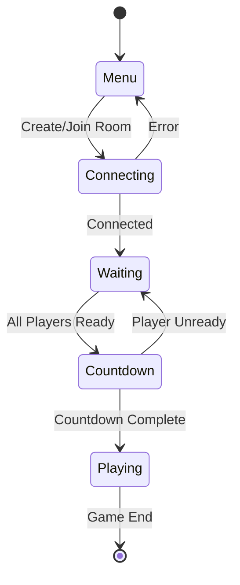

# Parkour Legion - Codebase Survey

**Date:** 2025-11-16
**Survey Mode:** Research Mode
**Status:** Complete

---

## 🎯 Project Overview

**Parkour Legion** is a multiplayer parkour racing game prototype built with Unity and Colyseus. Players compete to reach the finish line using parkour movement mechanics (walk, run, jump, slide) in a multiplayer environment supporting 2-4 players per room.

### Quick Facts
- **Engine:** Unity (C#)
- **Multiplayer Backend:** Colyseus (Node.js WebSocket)
- **Camera System:** Cinemachine 3.x
- **Network Model:** Client-authoritative (prototype-friendly)
- **Server URL:** `wss://parkour-demo-colysues-server.onrender.com`
- **Max Players:** 4 per room
- **Character Skins:** 18 models

---

## 📂 Project Structure

```
Assets/_0_Custom/
├── Scripts/
│   ├── Player/                  # Player controller & state machine
│   │   ├── PlayerController.cs
│   │   ├── PlayerStateMachine.cs
│   │   ├── PlayerInputHandler.cs
│   │   ├── PlayerPhysics.cs
│   │   ├── PlayerModelManager.cs
│   │   └── States/              # 6 movement states
│   │       ├── PlayerState.cs (abstract base)
│   │       ├── IdleState.cs
│   │       ├── WalkState.cs
│   │       ├── RunState.cs
│   │       ├── JumpState.cs
│   │       ├── FallState.cs
│   │       └── SlideState.cs
│   ├── Camera/
│   │   └── CameraInputProvider.cs
│   ├── Networking/              # Multiplayer synchronization
│   │   ├── NetworkManager.cs
│   │   ├── LocalPlayerNetworkSync.cs
│   │   ├── RemotePlayerNetworkSync.cs
│   │   └── RemotePlayerController.cs
│   ├── Schema/                  # Colyseus state schemas
│   │   ├── ParkourRoomState.cs
│   │   └── PlayerState.cs
│   └── UI/                      # UI components
│       ├── GameUIManager.cs
│       ├── MenuUI.cs
│       └── LobbyUI.cs
└── _Notes/
    ├── design/                  # Design documentation
    ├── research/                # Technical research
    └── logs/                    # Development logs
```

---

## 🏗️ Core Systems Architecture

### 1. Player Controller System
**Location:** `Scripts/Player/`

**Design Pattern:** State Machine Pattern

**Key Components:**
- **PlayerController.cs** - Main orchestrator using CharacterController component
- **PlayerStateMachine.cs** - Manages state transitions between 6 states
- **PlayerPhysics.cs** - Custom gravity and physics calculations (-9.81 m/s²)
- **PlayerInputHandler.cs** - Input detection (WASD, Space, Shift, C)
- **PlayerModelManager.cs** - Manages 18 character model skins

**Movement States:**
1. **Idle** - Stationary on ground
2. **Walk** - Base movement (5 units/s)
3. **Run** - Sprint movement (8 units/s, hold Shift)
4. **Jump** - Ascending phase after jump
5. **Fall** - Descending/falling phase
6. **Slide** - Parkour slide action (10 units/s initial)

**Key Design Decisions:**
- Uses `CharacterController` instead of Rigidbody (better network sync, no physics overhead)
- Custom gravity application instead of Unity physics
- State-based movement logic for clean separation of concerns
- Movement enabled/disabled flag for game state control

**Reference:** `D:\_UNITY\parkour legion demo\Assets\_0_Custom\Scripts\Player\PlayerController.cs:1`

---

### 2. Networking System
**Location:** `Scripts/Networking/`

**Architecture:** Colyseus WebSocket Client-Server

**Key Components:**
- **NetworkManager.cs** - Connection manager, room creation/joining, player spawning
- **LocalPlayerNetworkSync.cs** - Sends local player state to server (20 updates/sec)
- **RemotePlayerNetworkSync.cs** - Interpolates remote player positions
- **RemotePlayerController.cs** - Visual representation of remote players

**Network Flow:**
```
Client → NetworkManager.CreateRoom(skinId) → Colyseus Server
                                            ↓
                                    Generates 4-char room code
                                            ↓
                                    Creates room, assigns spawn
                                            ↓
Client ← LocalPlayerNetworkSync ← Server broadcasts state patches (30fps)
                                            ↓
Remote Players ← RemotePlayerNetworkSync ← Interpolates positions
```

**Synced Data:**
- Position (x, y, z)
- Rotation (Y-axis only)
- Movement state (0-5 enum)
- Grounded status (boolean)
- Skin ID (0-17)
- Ready state (boolean)

**Room Code System:**
- 4-character alphanumeric codes (e.g., "AB3C")
- Excludes ambiguous characters (0/O, 1/I)
- Room lookup via REST API: `/api/find-room/:code`
- Max 4 players per room

**Reference:** `D:\_UNITY\parkour legion demo\Assets\_0_Custom\Scripts\Networking\NetworkManager.cs:1`

---

### 3. Game State Management
**Location:** `Scripts/UI/GameUIManager.cs`

**State Machine:**


**Game States:**
1. **Menu** - Title screen, create/join room interface
2. **Connecting** - Connecting to server
3. **Waiting** - In lobby, waiting for players to ready up
4. **Countdown** - 3-second countdown before game start
5. **Playing** - Active gameplay

**State Transitions:**
- Menu → Connecting: Player clicks Create/Join
- Connecting → Waiting: Server connection established
- Waiting → Countdown: Min 2 players + all ready
- Countdown → Playing: Timer reaches 0
- Any State → Menu: Connection error/disconnect

**Cursor Control:**
- Menu/Lobby: Cursor unlocked
- Playing: Cursor locked (ESC to unlock)

**Reference:** `D:\_UNITY\parkour legion demo\Assets\_0_Custom\Scripts\UI\GameUIManager.cs:7`

---

### 4. Camera System
**Location:** `Scripts/Camera/CameraInputProvider.cs`

**Architecture:** Cinemachine 3.x OrbitalFollow

**Settings:**
- Mouse sensitivity: 200 (horizontal), 2 (vertical)
- Third-person orbital follow
- Dynamic distance adjustment on collisions
- Cursor lock/unlock control (ESC toggle)

**Integration:**
- Follows `CameraTarget` transform on LocalPlayer
- Input provider handles mouse delta
- Managed by GameUIManager for state-based cursor control

---

### 5. Character Model System
**Location:** `Scripts/Player/PlayerModelManager.cs`

**Status:** ✅ CODE COMPLETE - Needs Unity Editor Setup

**Architecture:**
- **18 Character Models** with unique skinId (0-17)
- **Model Container:** "GFXs" GameObject with child models
- **Activation:** SetActive() switching (no runtime instantiation)
- **Animation:** Single Animator component with "state" parameter (0-5)

**Network Sync:**
- Player selects skin in menu (or random assignment)
- SkinId sent to server on join
- Server broadcasts skinId to all clients
- Local/Remote players sync visual models

**Pending Work:**
- Unity Editor setup: Add PlayerModelManager component to prefabs
- Assign GFXs container references
- Verify Animator controllers on all 18 models

**Reference:** `D:\_UNITY\parkour legion demo\Assets\_0_Custom\_Notes\design\parkour-prototype\player-models\IMPLEMENTATION-STATUS.md`

---

## 🎮 Implementation Status

### ✅ Fully Implemented Systems
- [x] Player state machine (6 states)
- [x] Custom physics system
- [x] Input handling
- [x] Camera controller (Cinemachine)
- [x] Network connection (Colyseus)
- [x] Local/Remote player sync
- [x] Room code system (create/join)
- [x] Ready state system
- [x] Game state management (Menu → Playing)
- [x] Character model system (code complete)

### ⏳ Partially Complete
- [ ] Character model Unity setup (code done, editor setup pending)
- [ ] Animator controller verification (18 models)

### 📝 Designed But Not Implemented
- [ ] Checkpoint system
- [ ] Race timer/leaderboard
- [ ] Respawn system
- [ ] Finish line detection

### 🔮 Future Features
- [ ] Wallrun mechanics
- [ ] Vault mechanics
- [ ] Ledge climbing
- [ ] Server-side validation (anti-cheat)

---

## 🧩 Key Technical Patterns

### State Machine Pattern
Used in **PlayerStateMachine** and **GameUIManager** for clean state transitions.

**Example:** `Scripts/Player/PlayerStateMachine.cs:1`
```csharp
// Abstract base class
public abstract class PlayerState {
    public abstract void Enter();
    public abstract void Update();
    public abstract void Exit();
    public abstract void CheckTransitions();
}

// Concrete state
public class IdleState : PlayerState {
    public override void CheckTransitions() {
        if (input.magnitude > 0.1f) {
            stateMachine.ChangeState<WalkState>();
        }
    }
}
```

### Component-Based Architecture
PlayerController aggregates components (CharacterController, InputHandler, Physics, StateMachine).

**Benefits:**
- Clear separation of concerns
- Easy to test individual components
- Modular and extensible

### Client-Authoritative Networking
Local player has full control, server trusts client positions.

**Trade-offs:**
- ✅ Prototype-friendly (no server physics)
- ✅ Lower latency for local player
- ✅ Simpler implementation
- ⚠️ Vulnerable to cheating (not production-ready)

**Future Migration Path:**
- Add server-side validation
- Implement server reconciliation
- Add lag compensation

---

## 📊 Code Quality Observations

### Strengths
- **Consistent naming conventions** (PascalCase for public, camelCase for private)
- **Clear separation of concerns** (state machine, physics, input all separate)
- **Good use of Unity serialization** ([SerializeField] for inspector exposure)
- **Comprehensive documentation** (design docs with implementation plans)
- **Follows project coding standards** (no inner-function comments, structural comments only)

### Areas for Improvement
- **No unit tests** (consider adding for state transitions, physics calculations)
- **Some magic numbers** (e.g., update rates, speeds - could be centralized in ScriptableObject)
- **Limited error handling** in network code (basic try-catch, could be more robust)
- **No logging strategy** (Debug.Log everywhere, consider logging levels)

### Code Organization
- **Excellent namespace usage** (ParkourLegion.Player, ParkourLegion.Networking, etc.)
- **Proper folder structure** (Scripts organized by domain)
- **Design-first workflow** (documented designs before implementation)

---

## 🔍 Dependencies & Integration Points

### Unity Packages
- **Cinemachine 3.x** - Camera system
- **Colyseus SDK** - Multiplayer networking
- **Unity Input System** (implied, may be using legacy Input)

### External Services
- **Colyseus Server:** `wss://parkour-demo-colysues-server.onrender.com`
- **Room Lookup API:** `https://parkour-demo-colysues-server.onrender.com/api/find-room/:code`

### Critical Integration Points
1. **NetworkManager ↔ GameUIManager** - State synchronization
2. **PlayerController ↔ LocalPlayerNetworkSync** - Position updates
3. **GameUIManager ↔ CameraInputProvider** - Cursor control
4. **NetworkManager ↔ Cinemachine Camera** - Follow target assignment

---

## 🐛 Potential Issues & Risks

### Current Known Issues (from logs.md and git status)
- `Scripts/Networking/NetworkManager.cs` modified but uncommitted
- `_Notes/logs.md` exists but empty (1 line)

### Potential Risks
1. **Network Latency:** Room lookup via HTTP could introduce delay
2. **Room Code Collisions:** Low probability but possible (4 chars = ~1.6M combinations)
3. **WebSocket Connection Stability:** Render.com deployment may have cold starts
4. **Unity WebRequest Async:** Compatibility with Unity's main thread

### Edge Cases Handled
- ✅ Room not found (error handling)
- ✅ Room full (max 4 players)
- ✅ Player disconnect during countdown (cancels countdown)
- ✅ Unready during countdown (cancels countdown)
- ✅ Case sensitivity (room codes uppercase)

---

## 📖 Documentation Quality

### Excellent Documentation
The project has **exceptional documentation structure**:

**Design Documents:** `_Notes/design/parkour-prototype/`
- Component overview with dependency diagrams
- Detailed system designs with state machines
- Implementation plans with checkboxes
- Implementation status tracking

**Research Notes:** `_Notes/research/colyseus/`
- Colyseus framework overview
- Unity integration guides
- State synchronization patterns

**Project Overview:** `_Notes/project-overview.md`
- Comprehensive codebase map
- Architecture overview
- Implementation status
- Git history tracking

**Code Comments:**
- Follows CLAUDE.md guidelines (structural only, no explanatory)
- XML comments on public APIs
- Clear method/class descriptions

---

## 🎯 Development Workflow

### Design-First Approach
1. **Design Mode** → Document system architecture in `_Notes/design/`
2. **Implementation Plan** → Create implementation-plan.md with checkboxes
3. **User Confirmation** → Get approval before coding
4. **Implementation Mode** → Write production-ready code
5. **Status Tracking** → Update IMPLEMENTATION-STATUS.md or IMPLEMENTATION-COMPLETE.md

**Example:** Room Code System
- ✅ Design: `room-code-system/architecture-design.md`
- ✅ Plan: `room-code-system/implementation-plan.md`
- ✅ Status: `room-code-system/IMPLEMENTATION-COMPLETE.md`

---

## 🚀 Next Recommended Actions

### Immediate (Current Sprint)
1. **Character Models Unity Setup** (15-30 min)
   - Add PlayerModelManager to LocalPlayer/RemotePlayer prefabs
   - Assign GFXs container references
   - Verify Animator controllers on 18 models

2. **Commit Pending Changes** (5 min)
   - NetworkManager.cs modifications
   - logs.md cleanup

### Short-Term (Next Sprint)
3. **Testing & Validation** (2-4 hours)
   - Multi-client testing with room codes
   - Ready state synchronization
   - Skin selection testing
   - Edge case validation

4. **Race Game Logic** (6-8 hours)
   - Checkpoint system implementation
   - Race timer
   - Finish line detection
   - Leaderboard display

### Medium-Term (Future)
5. **Advanced Parkour Mechanics**
   - Wallrun state
   - Vault state
   - Ledge climbing

6. **Server-Side Validation**
   - Movement validation
   - Anti-cheat measures
   - Server reconciliation

---

## 📊 Project Metrics

**Total C# Files:** 22
**Total Lines of Code:** ~2500+ (estimated)
**Total Design Docs:** 18 markdown files
**Documentation-to-Code Ratio:** Very High (excellent)

**Git Status:**
- **Branch:** main
- **Recent Commits:** 10+ commits (safe commits, feature implementations)
- **Uncommitted Changes:** NetworkManager.cs, logs.md

**Development Phase:** Pre-production prototype
**Code Maturity:** MVP feature-complete, needs polish

---

## 🎨 Code Style Adherence

### Follows CLAUDE.md Guidelines ✅
- **No inner-function comments** ✅
- **Structural comments only** ✅
- **Scripts in Scripts/ subdirectories** ✅
- **Design → Implementation workflow** ✅
- **No patch files** ✅
- **Production-ready code** ✅

### Coding Principles ✅
- **Pre-production mindset** (no migrations, clean implementation)
- **Path of least action** (minimal changes for fixes)
- **No exceptions for business logic** (logs only)
- **Evidence-based debugging** (thorough investigation)

---

## 🔗 Key File References

### Core Systems
- Player Controller: `Scripts/Player/PlayerController.cs:1`
- State Machine: `Scripts/Player/PlayerStateMachine.cs:1`
- Network Manager: `Scripts/Networking/NetworkManager.cs:1`
- Game UI Manager: `Scripts/UI/GameUIManager.cs:1`

### State Implementations
- Idle State: `Scripts/Player/States/IdleState.cs:1`
- Walk/Run/Jump/Fall/Slide States: Similar pattern

### Network Sync
- Local Sync: `Scripts/Networking/LocalPlayerNetworkSync.cs:1`
- Remote Sync: `Scripts/Networking/RemotePlayerNetworkSync.cs:1`

### Schemas
- Room State: `Scripts/Schema/ParkourRoomState.cs:1`
- Player State: `Scripts/Schema/PlayerState.cs:1`

---

## 📝 Summary

**Parkour Legion** is a well-architected multiplayer parkour racing prototype with:

✅ **Strengths:**
- Clean state machine architecture
- Comprehensive documentation
- Design-first workflow
- Clear separation of concerns
- Production-ready code quality

⚠️ **Areas for Attention:**
- Unity Editor setup needed for character models
- Testing required for room code system
- Future need for server-side validation

🎯 **Project Health:** **Excellent**
- Clear architecture
- Well-documented
- Following best practices
- Ready for next phase of development

---

**Survey Complete**
**Mode:** Research Mode → Ready for next task
